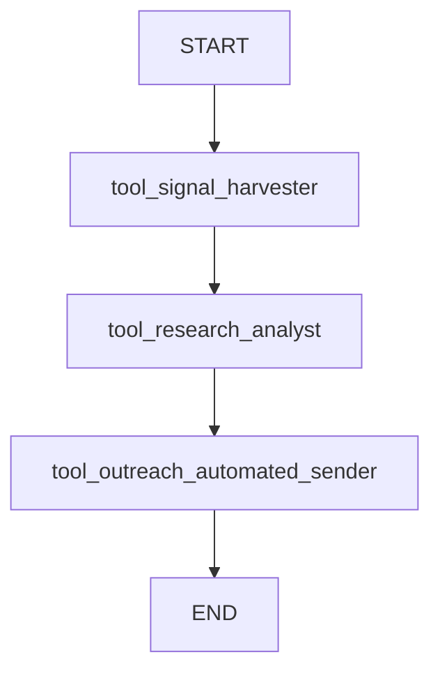

# FireReach System Documentation & Deployment Guide

## 1. Agent Logic Flow

The orchestrator operates on a deterministic LangGraph workflow ensuring the constraints of exactly three distinct Agent Tools are executed sequentially without hallucination loops.

## 2. Tool Schemas

* `tool_signal_harvester`
  * **Input**: `company_name` (str)
  * **Output**: `signals` (JSON str)
  * **Behavior**: Hits the Tavily Search API with intent-focused keywords (e.g., *"{company_name} funding OR hiring OR expansion OR product launch..."*). Returns a list of the 5 most critical growth indicators.

* `tool_research_analyst`
  * **Input**: `icp` (str) + `signals` (str)
  * **Output**: `account_brief` (str)
  * **Behavior**: Invokes Groq Llama-3 to analyze the raw harvested growth signals against the Ideal Customer Profile. Generates a two-paragraph strategic brief highlighting the company's pain points.

* `tool_outreach_automated_sender`
  * **Input**: `signals` (str) + `account_brief` (str) + `email` (str)
  * **Output**: `email_content` (str) + `delivery_status` (str)
  * **Behavior**: Drafts a highly personalized cold email enforcing the explicit referencing of the harvested signals based on the crafted account brief. Triggers a live dispatch of the email through the SendGrid SMTP API.

## 3. System Prompting Constraints

Within `tool_outreach_automated_sender`, the core system prompt given to Groq is enforced as follows:
> "You are a top-tier B2B Account Executive. Draft a highly personalized, concise cold email.
> CRITICAL CONSTRAINT: You MUST explicitly reference at least one of the specific growth signals (e.g., funding, hiring trends, leadership changes) provided below."

## 4. Architecture

1. **React Frontend (Vite)**: A user dashboard providing a form. It captures the ICP, Company, and Email and triggers the remote server via Axios.
2. **FastAPI Backend**: Receives the payload and initializes the `AgentState` within the `langgraph` executor.
3. **LangGraph Agent Workflow**: Takes control to strictly chain the isolated agent node logic, passing the growing state outputs chronologically down the edge mappings.
4. **Groq LLM**: Used as the hyper-fast reasoning brain inside the analysis and outreach tool nodes.
5. **Tavily Search API**: Provides deterministic, real-world data inside the signal harvester node.
6. **SendGrid Mail Service**: Authorized sender service to push the drafted payload to SMTP endpoints.

## 5. Example Execution

**Input:**
* `ICP`: B2B SaaS companies focused on developer tooling.
* `Company`: Vercel
* `Email`: founder@vercel.example.com

**Output Trace:**
* **Signals**: *Extracted news item regarding Vercel's recent v0 launch and major frontend engineering hiring sprint.*
* **Account Brief**: *Vercel is experiencing rapid expansion... Given the ICP of developer tooling, they likely need...*
* **Generated Email**: *Subject: Supercharging Vercel's Dev Tools... Hi there, I noticed Vercel's recent launch of v0 and your aggressive hiring for frontend engineers...*
* **Delivery Status**: *Sent successfully via SendGrid (Status: 202)*

---

## 6. Zero-Cost Free Deployment Guide

The following steps explain how to deploy both the Python backend and React frontend absolutely free, without credit cards.

### Deploying the FastAPI Backend (Render Free Tier)

1. **Create Account**: Go to [Render](https://render.com/) and create a free account linked to your GitHub.
2. **Launch Web Service**: Click **New +** -> **Web Service**.
3. **Connect Repo**: Select your `firereach` GitHub repository.
4. **Configuration Settings**:
   * **Name**: `firereach-api`
   * **Root Directory**: `backend` (CRITICAL: ensure it points to the backend subfolder).
   * **Environment**: `Docker` (Render will automatically detect the `Dockerfile` inside the `/backend` folder).
   * **Instance Type**: Select "Free".
5. **Environment Variables**: Click "Advanced" -> "Add Environment Variable" and add your production keys:
   * `GROQ_API_KEY`: <your-groq-key>
   * `TAVILY_API_KEY`: <your-tavily-key>
   * `SENDGRID_API_KEY`: <your-sendgrid-key>
   * `SENDER_EMAIL`: <your-verified-email>
6. **Deploy**: Click **Create Web Service**. 
7. **Test**: Once live, test it by navigating to `https://firereach-api.onrender.com/docs`.

### Deploying the React Frontend (Vercel Free Tier)

1. **Create Account**: Go to [Vercel](https://vercel.com/) and create a free "Hobby" account linked to your GitHub.
2. **Add New Project**: Click **Add New...** -> **Project**.
3. **Connect Repo**: Import your `firereach` GitHub repository.
4. **Configuration Settings**:
   * **Framework Preset**: Vercel will auto-detect "Vite".
   * **Root Directory**: Click "Edit" and type `frontend`. This tells Vercel where the React app lives.
5. **Environment Variables**: Expand the environment variables section and add the Render API connection string:
   * **Name**: `VITE_API_URL`
   * **Value**: `https://firereach-api.onrender.com/api/v1` *(Ensure you swap in your exact Render backend URL here).*
6. **Deploy**: Click **Deploy**. Vercel will parse the `vercel.json` file inside `/frontend` to correctly configure the React SPA routing.
7. **Test**: Vercel will return your live URL (e.g., `https://firereach-ui.vercel.app`).

### 7. Final Verification

To verify the massively deployed system:
1. Open your live Vercel frontend URL in a browser.
2. Input a test campaign (e.g., "AI Tooling", "Acme Corp", "test@test.com").
3. Click "Initialize Workflow".
4. Confirm the React interface connects to Render, triggers the LangGraph chain, and successfully renders the agent reasoning trace, harvested signals, brief, drafted email, and a successful delivery badge.
